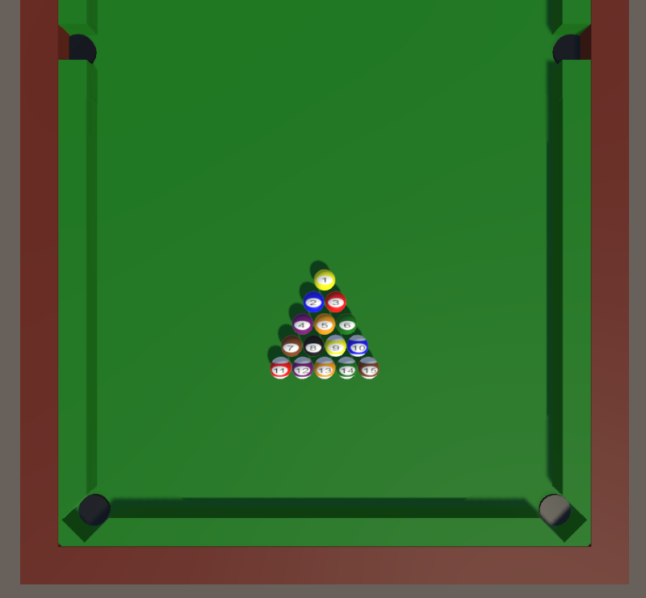

# Assignment 7

기초 스터디 7차시 Unity 3차시에 대한 과제입니다.

 

**유니티 2022.3.26f1 버전을 사용하였습니다.**

 

Unity Hub를 실행하시고

Projects > Add > Add project from disk를 누르시고,

Poketball Sample 폴더를 선택하시면 목록에 추가됩니다.

 

명세를 잘 읽고, Scene을 만들고 Assets/Scripts 안에 파일들을 완성해주세요.

 

제출 시에는 스터디장의 안내에 따라 정해진 branch에 push해주세요.

## 1. Scene

1. 다음 프리팹을 배치하세요.
- Billiard Table
- TouchPad

2. "GameManager"라는 빈 오브젝트를 생성하여 Scripts/GameManager를 붙이세요.

Ball Prefab에 Prefab/Ball을 붙이세요.

3. Ball 프리팹을 (0, 0, 6.35)에 배치한 후에, Materals/White 매터리얼을 적용하세요.

이름을 PlayerBall로 변경하세요.

4. Canvas를 생성하고 Scripts/UIManager를 붙이세요.

Prefab/Text를 자식으로 붙이고 이름을 "MyText"로 변경하세요.

5. Main Camera의 Transform을 다음과 같이 변경하세요.

- Position = (0, 15, 0)
- Rotation = (90, 0, 0)

## 2. GameManager

시작시 아래 모양으로 공들을 배치합니다.

카메라는 PlayerBall을 CamSpeed의 속도로 따라갑니다.

 

좌클릭시 클릭한 방향으로 PlayerBall이 이동합니다.

공이 떨어지면 해당 공이 떨어졌음을 1초간 출력합니다.

## 3. UIManager

DisplayText를 이용하여 duration초 동안 text를 화면에 띄울 수 있습니다.